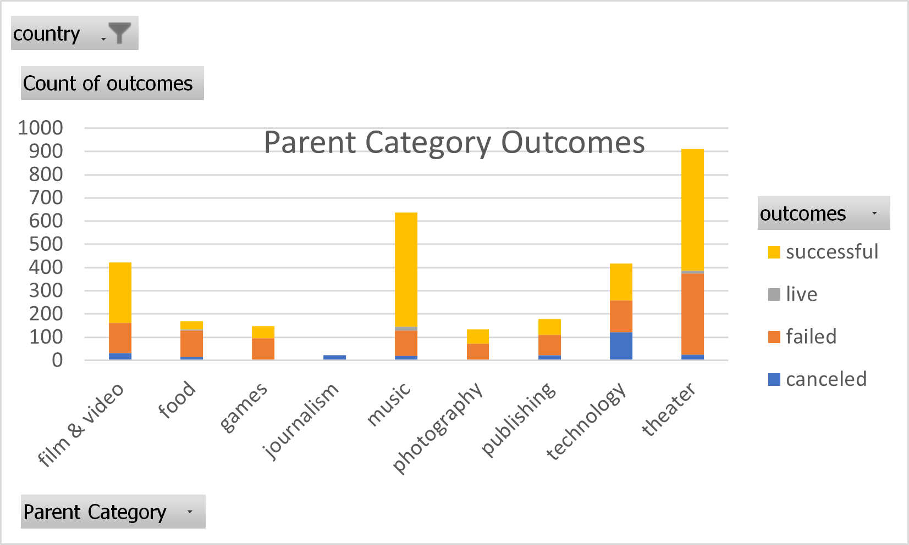
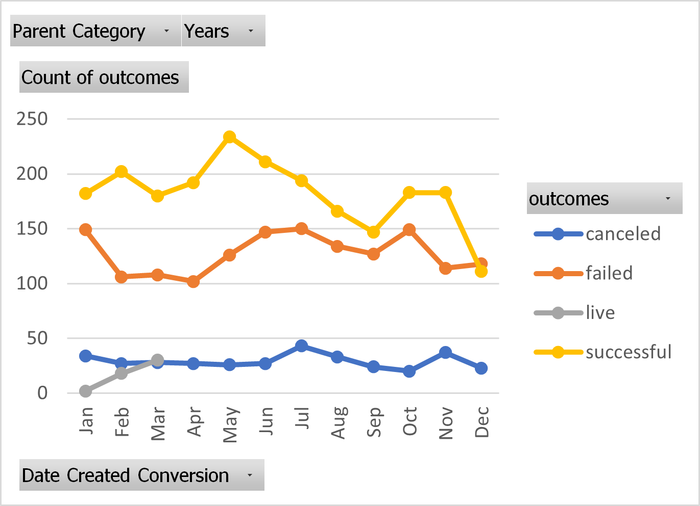
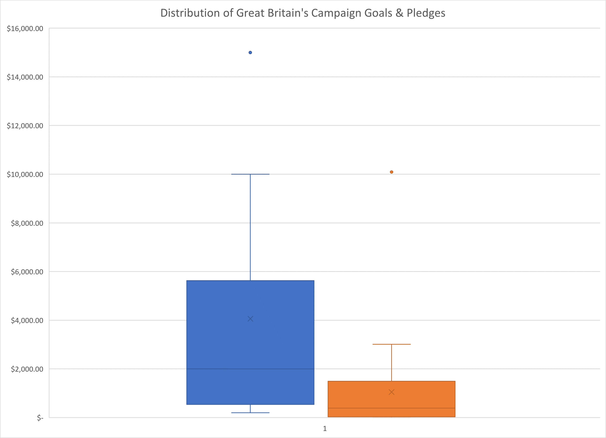

# An Analysis of Kickstarter Campaigns
Performing analysis on Kickstarter data to uncover trends
## Parent Category Outcomes
This analysis shows that overall, Theater campaigns have been quite successful!

## Outcomes Based on Launch Dates
The month that launched the most successful Kickstarter campaigns was May. However, January, June, July and October all had roughly the same number of failed campaigns launched.

## Distribution of Campaign Goals in Great Britain
From these plots shown below, we can see that the mean campaign goal is around £4,000. This is outside of the range of outliers for amount pledged, so you should probably try to get your play produced for less than £4,000. Half of the campaign goals are less than £2,000, which is just over the 3rd quartile for amounts pledged.

