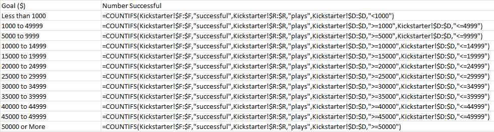
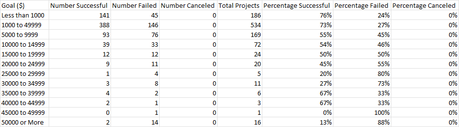

# Kickstarting with Excel

## Background of Project
Louise's play, Fever, came close to its fundraising goal in a short amount of time! I have analyzed the data to see how other plays compared in regard to their launch dates and and their funding goals.

##  Purpose of this Analysis
The purpose of this analysis is to see how different theater campaigns fared in relation to their launch dates and how they fared in relation to the funding goals for plays.

### Analysis and Challenges

I performed my first analysis (Outcomes Based on Launch Date) by creating a pivot table and line chart for theater outcomes by launch date, using only the month of the fundraiser start date and only focusing on fundraisers that are no longer active. All years were included in this analysis to determine what, if any, trends existed for the various campaign outcomes over a 12 month period. I do not feel like I experienced many challenges with this analysis due to previous experience working with Pivot Tables. I could see how this could be challenging to someone who does not have much experience in pivot tables and charts though. Figuring out where to place the field names in the Pivot Table pane could be confusing for some along with figuring out what is meant by filtering the campaign outcomes in decending order as a pivot table is not setup like a regular spreadsheet that is filtered per column. 

I performed the second analysis (Outcomes Based on Goals) by creating a worksheet with specific goal criteria identified. Using that goal criteria (shown below in figure 2.1), specific outcome criteria, and setting the subcategory criteria to "play", allowed me to display a count of how many campaign outcomes were successful, failed, or canceled based on those specific goal ranges shown. The formula used to determine those numbers is the CountIfs function. Once the counts of each of those goal criteria were determined, a sum function was used to get the total number of plays. Dividing the number of each outcome category by the total and then formatting as a percentage, gave the percentage successful, canceled, and failed. 
Using the countifs function was not necessarily challenging for me as I was able to copy the formulas down into the respective columns and rows and just updated the criteria as needed to save some time. The challenge was having to type in the goals parameters in the countifs function - It would have saved even more time if I could have just referenced the goal range in the formula rather than manually typing it. I am hoping that I will learn a quicker, more efficient way to perform this type of formula with specified ranges in the future. I can see that this formula could be very challenging and confusing for someone who does not have any experience with using it. Especially because the formula used for this analysis had several different critiera nestled into one formula. Missing commas, mispelled words, missing quotations, and incorrect symbols would cause this formula to not calculate correctly. Figure 2.2 below shows a sample of the countifs formulas I used in this analysis. Figure 2.3 shows the data compiled after all formulas (countifs, sum, percentages) were ran.

Figure 2.1 Goal Criteria

Figure 2.2 CountIFs Formulas

Figure 2.3 Completed Goal Data after running all formulas

The full workbook with all data and charts can be downloaded here:
[Kickstarter Challenge](https://github.com/Kcav18/kickstarter-analysis/blob/Module-1-Challenge/Kickstarter_Challenge.xlsx) 

### Analysis of Outcomes Based on Launch Date

We can tell from the chart above that theater campaigns in all countries see more success than failure since 2009!

The data suggests that May and June seem to be the best months to kickstart a theater campaign! After June, the success rate drops and doesnt start to really pick back up again until around Spring. The time of year does not really suggest that one is more likely to have a failed campaign. The failure rate is fairly consistent all year. This also goes for campaigns that are canceled. Successful Theater campaigns seem to be the norm but with better success rates in the early summer.

My recommendation from this analysis is to not start the fundraising campaign until April, May, or June.

### Analysis of Outcomes Based on Goals

Since the launch date did not seem to make a difference whether a campaign failed or was canceled, a further analysis on campaigns for plays was completed.

Review the chart below:

Based on the data shown above, the higher the goal, the more likely a campaign is to fail. You can see the successful goals by looking at the blue line on the graphic below. The higher the goals are, the lower the line gets and the higher the orange, failure line gets. With the exception of a few plays that had goals from $35,000 to $49,9999 and $50,000 or more. It looks as if these were successful, but please keep in mind that this had much fewer fundraising campaigns than the campaigns with lower goal amounts. In the 35,000 to 39,999 goal range, only 6 fundraising campaigns were launched. And out of those 6, 4 were successful. In the range of 40,000 to 49,999, there were only 3 fundraising campaigns and 2 were successful. We see one more small jump with the blue line when looking at the 50,000 or more range. There were only 2 successful campaigns out of 16 total. The successful campaigns with these higher goals had a significant amount of backers. 
*The successful fundraising campaigns that had a goal of 1,000 or less had an average of 18 backers per campaign. 
*The successful fundraising campaigns that had goals of 30,000 or less had an average of 51 backers per campaign. 
*The successful fundraising campaigns that had a goal of 35,000 or more had an average of 334 backers per campaign.
 
The high number of backers indicates that these campaigns had an excellent reach either through marketing, social media, or just very generous donors.

At this time, there do not appear to be any fundraising campaigns for plays that were canceled. 

My recommendation from this data analysis would be to keep the goal less than 15,000. This increases your odds of a successful campaign. I would also recommend 
finding as many backers as possible either through social media or other forms of marketing.

## Results

- What are two conclusions you can draw about the Outcomes based on Launch Date?
1. We can tell that theater campaigns in all countries see more success than failure since 2009.
2. May or June seem to be the best months to kickstart a theater campaign.

- What can you conclude about the Outcomes based on Goals?
1. The higher the goal amount, the more likely a campaign is to fail. 
2. The more backers a campaign has, the more likely they are to reach/ exceed their goal.
3. Setting a goal amount of $15,000 or less increases the likliehood of a successful campaign.

- What are some limitations of this dataset? This dataset doesnt give the full picture. Addtional data is needed to determine potential reasons why campaigns that had extremely high goal amounts were successful despite the overall trend that the higher the goal amount, the less likely one is to have success. The number of backers along with the average pledge amount would have been helpful in the analysis.

- What are some other possible tables and/or graphs that we could create? 
Data and visualizations that showed the pledge amount, the number of backers, and the average pledge amount per backer would have been a helpful analysis to determine goal outcomes. This type of data could lead to additional questions such as, "How did this campaign end up with so many backers?, "Why is the average pledge amount so high?". These questions could lead to addtional research to get a better understanding of the campaigns with the extreme goal amounts.
